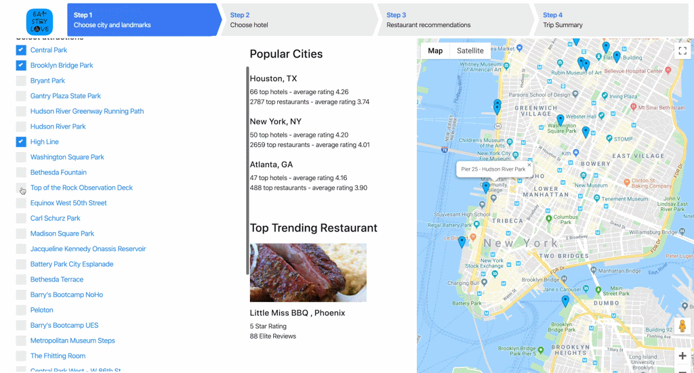

## Projects

---

### Travel Planner WebApp
Allows users to search for attractions, hotels, and restaurants from one place. Recommends top rated hotels and restaurants near the user's chosen attractions. 

Final project for UPenn's CIS550 Databases class. Nominated for Best All-Around Project Award.

Demo video: https://drive.google.com/open?id=1WYm1LLjcJeDsFEpXkRN5MOJOlsQ0hVbd

 
Backend: AWS OracleRDS Database
 
Frontend: AngularJS, NodeJS (Express)

---
### Predicting Airbnb Listing Price
Final project for CIS519 Applied Machine Learning class. 
 
The project aims to build a generalizable price prediction tool for Airbnb rental units - i.e. see if it is possible to train a model on data from one city (New York City) and then predict prices in a different city (San Francisco)
 
Evaluated three different machine learning models on generalizability: Linear Regression, LASSO Regression, and Support Vector Regression.

---

### Company Word Analysis with Twitter
Recommends whether to buy / sell / hold a stock based on sentiment regarding that company on twitter.

Final project for CIT594 Data Structures class. 

---